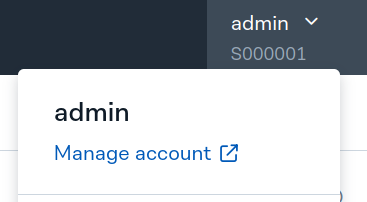
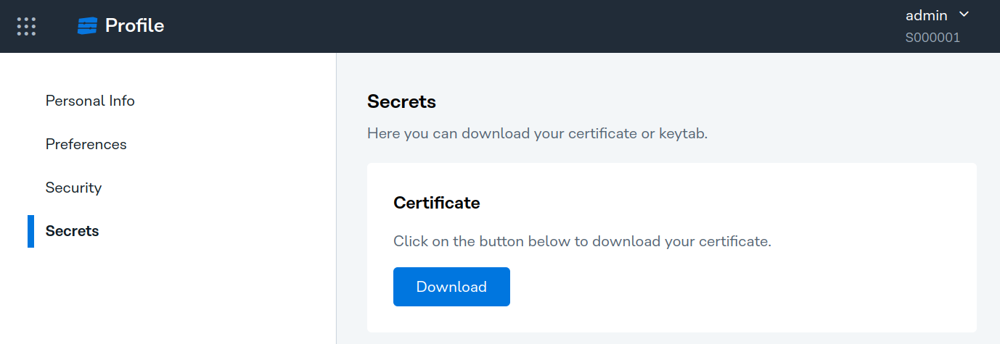
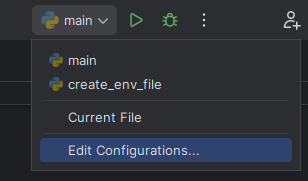
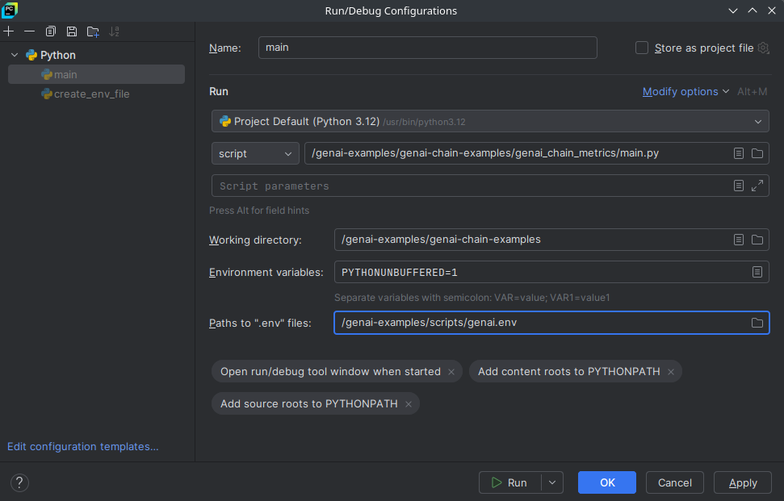

## Stratio GenAI Chain Examples

This repository is intended for developers who want to create GenAI chains using the *Stratio GenAI Core* framework so the chains can be easily be deployed in *Stratio GenAI API*.

| Git branch | GenAI Core version | 
|------------|--------------------|
| main       | 0.4.0              |
| branch-0.3 | 0.3.4              |

This repository provides some simple examples of GenAI chains focused on a specific task.
There are four basic chains that you can use as a starting point to create your own chains:

* [Basic Actor Chain](./example-chain-basic-actor/README.md): Example of a GenAI chain that implements a basic actor and invokes it.
* [Memory Chain](./example-chain-chat-memory/README.md): Example of a GenAI chain that persist the user's conversation in order to remember the context.
* [Opensearch Chain](./example-chain-opensearch/README.md): Example of a GenAI chain that connects to Opensearch service and processes the result of a search.
* [Stratio Virtualizer Chain](./example-chain-virtualizer/README.md): Example of a GenAI chain that connects to the Stratio Virtualizer service to perform a query.

Please check the readme of each chain for more information.

Stratio GenAI chains are built with [Poetry](https://python-poetry.org/docs/#installation), so in order to develop a chain you need to make sure you have the following tools in your machine:

* [Python](https://www.python.org/) >= 3.9
* [Poetry](https://python-poetry.org/docs/#installing-with-the-official-installer). >= 2.0 (We recommend to use the "official installer method".)
* A Python editor of you choice, like [PyCharm](https://www.jetbrains.com/pycharm/) or [Visual Studio Code](https://code.visualstudio.com/)

## Quick start guide (TLDR)

### *Stratio GenAI Developer Proxy*

You need access to *Stratio GenAI Developer Proxy* service. This service allows you to install the *Stratio GenAI Core* dependency and to access the services running in the Development environment from your local machine. The service is installed by Operations team. They will provide you a URL like this `https://genai-developer-proxy-loadbalancer.your-tenant-genai.yourdomain.com:8080`.

> **WARNING**: Make sure you use the Load Balancer URL, not the KEOS Ingress URL!

### User certificate

Download your [user certificates](#user-certificates) from *Stratio Gosec*.

### Install the dependencies

Move to an example directory, for example the `example-chain-basic-actor`, which contains a basic chain example:

```
$ cd genai-examples/example-chain-basic-actor
```

Edit the `pyproject.toml` file and change the `url` value with the URL of the *Stratio GenAI Developer Proxy* Load Balancer including path "/service/genai-api/v1/pypi/simple":

```toml
[[tool.poetry.source]]
name = "stratio-releases"
url = "https://genai-developer-proxy-loadbalancer.your-tenant-genai.yourdomain.com:8080/service/genai-api/v1/pypi/simple"
priority = "supplemental"
```

Install the dependencies with Poetry (use the path to your certificates):

```
$ poetry config virtualenvs.in-project true
$ poetry config certificates.stratio-releases.cert /path/to/your/cert/folder/ca-cert.crt
$ poetry lock --no-update
$ poetry install
```

### Configure the needed environment variables

Execute the following commands to configure the environment variables:

```
$ python ../scripts/create_env_file.py \
    --certs_path /path/to/certs \
    --proxy_url https://genai-developer-proxy-loadbalancer.your-tenant-genai.yourdomain.com:8080
```

You will find the files `genai-env.env` and `genai-env.sh` in the `genai-examples/scripts` folder with the environment variables.

### Run the chain

#### Pycharm

If you use PyCharm, follow [those steps](#running-from-pycharm) to run the chain.

#### Other editors

Source the environment variables and launch the `main.py` script in the Poetry environment to run the chain locally:

```
$ source ../scripts/genai-env.sh
$ poetry run python basic_actor_chain/main.py
```

You can see the logs in the terminal. 

### Test the chain

If the chain is running, you can open the web interface of the chain in the browser.

* http://127.0.0.1:8080

Use the endpoint `POST /invoke` to test the chain. An example of request body for the invoke POST is the following:

```json
{
  "input": {
     "user_request": "Hi! Nice to meet you! Where is the Queen of Hearts?"
  }
}
```

### Build and deploy the chain

When your chain is ready, you can [build](#building-your-chain) and [deploy](#deploying-your-chain) it in *Stratio GenAI API*.

## Local development

Stratio GenAI chains are intended to run inside *Stratio GenAI API*. In order to try out your chain from your local machine while developing, *Stratio GenAI Core* provides a GenAI-API-like standalone server that can be started in your computer to serve your chain just as if it was deployed in *Stratio GenAI API*, exposing the `invoke` endpoint and a Swagger UI. All the examples in this repository contain a `main.py` file, used to run the chain locally, where you can see how to start this standalone server. The constructor of this standalone server receives as an argument the same configuration that would be passed in the request body when registering the chain in *Stratio GenAI API*. However, you will need some extra setup to be able to run chains in your local computer. The main problems are:

1. Since the chains run inside *Stratio GenAI API*, they can connect to several services, like *Stratio GenAI Gateway*, *Stratio Virtualizer*, Opensearch or *Stratio GenAI API*. Moreover, they will be able to use the *Stratio GenAI API* credentials to connect to them. The problem is that these services are not usually exposed outside the cluster, and if they were, you would need the correct *Stratio GenAI API* credentials, which may be not available to you.

2. Running inside *Stratio GenAI API* in the cluster, the chains have access to Vault, but it won't be accessible from your local machine.

3. Inside *Stratio GenAI API* there are always some environment variables configured which several *Stratio GenAI Core* components need to work properly. When running your chains locally, you should make sure that these environment variables are set with the correct values when needed.

4. *Stratio GenAI* chains use the *Stratio GenAI Core* framework as a dependency. However, this package is not public, so you will need access to a repository that can provide that dependency.

### *Stratio GenAI Developer Proxy*

The first and last problems above are solved by the *Stratio GenAI Developer Proxy*, which can be deployed in the development cluster to provide access to the services running inside the cluster, as well as to provide access to the PyPi server inside *Stratio GenAI API* containing the *Stratio GenAI Core* dependency.

Once the service in installed on your development cluster, it should be reachable through a URL like this: `https://genai-developer-proxy-loadbalancer.your-tenant-genai.yourdomain.com:8080`. Then, under different paths on that server, you can access the different services. For instance, the *Stratio GenAI Gateway* would be accessed from your local machine through  `https://genai-developer-proxy-loadbalancer.your-tenant-genai.yourdomain.com:8080/service/genai-gateway`. All the available services, with their path in *Stratio GenAI Developer Proxy* are listed in the following table:
| service                 | Developer proxy path                |
|-------------------------|-------------------------------------|
| *Stratio GenAI Gateway* | `/service/genai-gateway`            |
| *Stratio GenAI API*     | `/service/genai-api`                |
| *Stratio Virtualizer*   | `/service/virtualizer`              |
| Opensearch              | `/service/opensearch`               |
| *Stratio Governance*    | `/service/governance`               |
| PyPi server             | `/service/genai-api/v1/pypi/simple` |

Note that, depending on how the *Stratio GenAI Developer Proxy* is configured on the development cluster, some of these services may be not exposed.

### User authentication and authorization

When a chain that is running in *Stratio GenAI API* is invoked, several things happen:

1. *Stratio GenAI API* authenticates the invoking user.
2. *Stratio GenAI API* checks if the invoking user has a role authorized to make chain invocations.
3. *Stratio GenAI API* executes the chain, adding extra configuration metadata with information about the invoking user.
4. When the chain calls a service, it uses the identity of *Stratio GenAI API* and, if applicable, impersonates the calling user on the called service.

When running the chains locally, however, you won't have access to the *Stratio GenAI API* certificates to configure your chain to use them to authenticate itself with the services. Again, this problem is solved by the *Stratio GenAI Developer Proxy*, which does have access to the *Stratio GenAI API* credentials. It works as follows:

1. You run the chain locally configuring *your own* certificates.
2. The chain access the services through the *Stratio GenAI Developer Proxy* using *your* certificates.
3. The *Stratio GenAI Developer Proxy* checks if you are authorized to make chain invocations by checking your role on *Stratio GenAI API*.
4. When the *Stratio GenAI Developer Proxy* routes the chain requests to the corresponding service, it uses the *Stratio GenAI API* identity and, when applicable, impersonates your user.

Note that the behavior of the *Stratio GenAI Developer Proxy* in points `3` and `4` above imply that, when running the chain locally but accessing the cluster services through the *Stratio GenAI Developer Proxy*, everything works just as if the chain had been deployed in *Stratio GenAI API* and you were invoking it. Thus, if the permissions set in the cluster allow your user to invoke your chain when deployed in *Stratio GenAI API* then everything should also work correctly when running the chain locally using your own certificates. 

### Vault client development mode

The chains may obtain the certificates needed to authenticate with other services using the Vault client provided in *Stratio GenAI Core*. To ease the development of chains from your local computer, this Vault client allows bypassing the actual access to Vault if certain environment variables are defined. When the following environment variables are defined, the Vault client will read them instead of going to Vault:

```bash
VAULT_LOCAL_CLIENT_CERT="/path/to/cert.crt"
VAULT_LOCAL_CLIENT_KEY="/path/to/private-key.key"
VAULT_LOCAL_CA_CERTS="/path/to/ca-cert.crt"
```
This way you do not need to access any Vault to develop your chain locally.

### User certificates 

You can obtain your user certificates from *Stratio GoSec*:

1. Access to *Stratio GoSec* to manage your account. You can do it from any Stratio application like *Stratio Talk To Your Data*. In the top right corner, click on your username and select *Manage Account*.



2. In your profile, go to the *Secrets* tab and download the *User certificate*.



3. Uncompress the ZIP file in your local machine. You will find the following files inside:

   * `ca-cert.crt`: Certificate authority
   * `<user>.crt`: User certificate
   * `<user>_private.key`: User private key

### Extra environment variables

Some clients provided in *Stratio GenAI Core*, like the *Stratio GenAI Gateway* client or the *Stratio GenAI API* client, obtain their certificates by reading some environment variables instead of accessing Vault. Also, they expect some other environment variables to be defined. In a "normal" chain execution inside *Stratio GenAI API*, these variables are already set in the *Stratio GenAI API* container. If your chain uses these clients, you should set the corresponding environment variables to run it locally.

For your convenience, we provide a script that generates two files with all the needed variables by just giving it the path to your certificates folder and the host of the *Stratio GenAI Developer Proxy*. Then, you can add it to PyCharm or source it in your terminal.

Execute the following command to configure the environment variables:

```
$ python scripts/create_env_file.py \
    --certs_path /path/to/certs  \
    --proxy_url https://genai-developer-proxy-loadbalancer.your-tenant-genai.yourdomain.com:8080
```

You will find the files `genai-env.env` and `genai-env.sh` in the `genai-examples/scripts` folder with the environment variables.

### *Stratio GenAI Core* dependency

The dependencies of your chain are declared in the `pyproject.toml` file of your chain Poetry project, and they are managed by Poetry. The *Stratio GenAI Core* package is not public, so in order for Poetry to be able to obtain it you need to configure a Poetry source where this package can be found. The *Stratio GenAI Developer Proxy* hosts a PyPi server where the dependencies can be found.

You should edit the `pyproject.toml` file and add a block like the following (changing the url with the actual URL of your *Stratio GenAI Developer Proxy*) including path "/service/genai-api/v1/pypi/simple":
```toml
[[tool.poetry.source]]
name = "stratio-releases"
url = "https://genai-developer-proxy-loadbalancer.your-tenant-genai.yourdomain.com:8080/service/genai-api/v1/pypi/simple/"
priority = "supplemental"
```

Also, in order to make Poetry trust this server, you need to configure it to use the CA of the cluster (the one included in the `zip` file with [your certificates](#user-certificates-and-vault-client-development-mode)):
```
$ poetry config virtualenvs.in-project true
$ poetry config certificates.stratio-releases.cert /path/to/your/cert/folder/ca-cert.crt
$ poetry lock --no-update
$ poetry install
```

### Running your chain locally

Once you have everything configured, you can create a python script (in our examples this is the `main.py` script) where the chain is deployed inside a standalone GenAI server running in your localhost:
```python
from genai_core.server.server import GenAiServer

def main(chain_config: dict):
    "Starts a standalone server with the chain loaded"
    app = GenAiServer(
        module_name="<module-of-your-chain-class>",
        class_name="<name-of-your-chain-class>",
        # dictionary of properties that will be passed to your chain class constructor
        config=chain_config
    )
    app.start_server()

if __name__ == "__main__":
    chain_config = { 
        # here you should define the config for your chain.
        # You can do it however you want, hardcoded in the script, by parsing command line
        # arguments or by reading environment variables (in our examples we usually read
        # environment variables)
    }
    main(chain_config)
```

#### Running from the command line

Now you can run your chain (note that the script should be called with `poetry run` to make it run in the environment of the Poetry project, which includes all the needed dependencies)
```
$ poetry run python main.py
```

This may fail if your `main.py` script or your chain expects some environment variables to be defined in order to work properly, like those pointing to your local certificates for the Vault or the Gateway client, as we explained above. If that is the case, you must set the needed environment variables before calling the script. Here we show an example setting the variables needed to [mock Vault](#user-certificates-and-vault-client-development-mode), but you can check all the variables that might be needed by generating the `.sh` file with the [helper script](#extra-environment-variables), or just using that generated file.

Create a file env.sh exporting the needed variables,
```bash
export VAULT_LOCAL_CLIENT_CERT="/path/to/cert.crt"
export VAULT_LOCAL_CLIENT_KEY="/path/to/private-key.key"
export VAULT_LOCAL_CA_CERTS="/path/to/ca-cert.crt"

# add here whatever other variables might be needed
# ...
# ...
```
source it
```
$ source env.sh
```
and run the script again. You will see the logs in the terminal, and you can open the web interface of the chain in the browser: http://127.0.0.1:8080. 

#### Running from PyCharm

Open the Poetry project of your chain in PyCharm:

* File => Open => Select the folder

Configure the Python interpreter:

* Python Interpreter => Add New Interpreter => Add Local Interpreter => Poetry Environment => Poetry environment

Execute the chain on PyCharm. 

* Right-click on the `main.py` file => Run 'main'

This may fail if your `main.py` script or your chain expects some environment variables to be defined in order to work properly, like those pointing to your local certificates for the Vault or the Gateway client, as we explained above. If that is the case, you must set the needed environment variables before calling the script. Here we show an example setting the variables needed to [mock Vault](#user-certificates-and-vault-client-development-mode), but you can check all the variables that might be needed by generating the `.env` file with the [helper script](#extra-environment-variables), or just using that generated file.

Create a file genai.env:
```
VAULT_LOCAL_CLIENT_CERT=/path/to/cert.crt
VAULT_LOCAL_CLIENT_KEY=/path/to/private-key.key
VAULT_LOCAL_CA_CERTS=/path/to/ca-cert.crt
ADD_HERE_OTHER_VARIABLES=that_might_be_needed
```
and add it to the `main.py` run configuration in PyCharm:

* Edit Configurations => Path to ".env" files => Select the `genai.env` file in the `genai-examples/scripts` folder.





Run the `main.py` file again. You will see the logs in the PyCharm console, and you can open the web interface of the chain in the browser: http://127.0.0.1:8080. 

### Building your chain

Once you have finished developing your chain you can build it with:

```
$ poetry build
```

You will find a `tar.gz` in the `dist` folder that you can use deploy the package and register the chain in *Stratio GenAI API*.

### Deploying your chain

To deploy your chain in *Stratio GenAI API* you need to upload the chain package we built in the previous section to the API and register the chain.

1. Upload the chain package to *Stratio GenAI API*:

```bash
curl -X 'POST' \
  'https://<your-genai-api-url>/v1/packages' \
  -H 'accept: application/json' \
  -H 'Content-Type: multipart/form-data' \
  -F 'package=@<basic-actor-chain-package>.tar.gz;type=application/gzip'
```

2. Register the chain. Note that the `chain_params` field in the chain registration request should contain the parameters that your chain class constructor expects:

```bash
curl -X 'POST' \
  'https://<your-genai-api-url>/v1/chains' \
  -H 'accept: application/json' \
  -H 'Content-Type: application/json' \
  -d '{
      "chain_id": "basic_actor_chain",
      "chain_config": {
        "package_id": "basic_actor_chain-0.3.4a0",
        "chain_module": "basic_actor_chain.chain",
        "chain_class": "BasicActorChain",
        "chain_params": {
          "gateway_endpoint": "openai-chat",
          "llm_timeout": 60
        }
      }
}'
```

3. Invoke the chain:

```bash
curl -X 'POST' \
  'https://<your-genai-api-url>/v1/chains/basic_actor_chain/invoke' \
  -H 'accept: application/json' \
  -H 'Content-Type: application/json' \
  -d '{
  "input": {
     "user_request": "Hi! Nice to meet you! Where is the Queen of Hearts?"
  }
}'
```

### Useful commands

* Execute all the tests: `poetry run pytest`
* Execute only unit test: `poetry run pytest tests/unit`
* Execute only integration test: `poetry run pytest tests/integration`
* Format the code execute `poetry run black ./`
* Lint the code execute `poetry run pylint './**/'`
* Check the Python's types execute `poetry run mypy ./`

